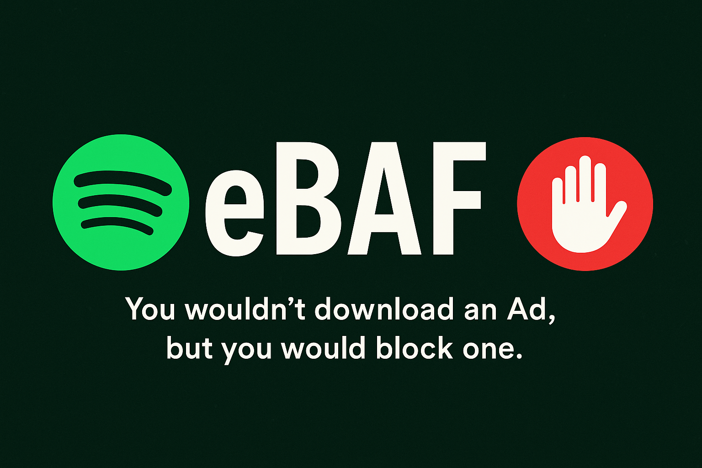

# eBPF - eBPF Ad Firewall
<p align="center">
    
</p>
## "You Wouldn't Download an Ad"
 
Spotify has built an empire on a simple formula: monetize your attention, underpay the artists, and sell you back your own time as a premium feature.
In their world, your listening experience is not yours. It’s a carefully curated marketplace — your ears are the product, your patience is the currency.

They like to call it a "free" tier.
But let’s be honest: it’s not free if you’re paying with your time.

Meanwhile, the artists you love — the people whose work keeps the platform alive — often earn mere fractions of pennies per stream. Spotify profits handsomely, the advertisers get their exposure, and the creators? They get scraps.

This isn’t just about skipping a few annoying ads.
It’s about refusing to participate in a system that profits from exploitation, distraction, and the commodification of your attention.

### What is this?
An elegant little act of digital resistance: a clean, open-source adblocker for Spotify that stops the noise — literally.

No sketchy mods, no cracked clients, no malware masquerading as freedom. Just one goal: let the music play without being held hostage by ads.

Spotify isn’t free — you pay with your patience.

They bombard you with the same grating ads, over and over, until you give up and subscribe. Not because you love Premium. But because you’ve been worn down. That’s not freemium — that’s psychological warfare with a playlist.

Meanwhile, the artists? Still underpaid.
The ads? Louder. More frequent. Sometimes literally louder.
You? Just trying to vibe.

They profit from your patience and their underpayment of creators, all while pretending it’s the only sustainable way. Spoiler: it isn’t. They had a choice — but they chose profit margins over people.

Spotify wants you to believe this is the cost of access.
We believe that’s a lie.

We’re not pirates. We’re not criminals. We’re just people who think it's okay to draw a line.

This project isn’t about skipping a few ads. It’s about rejecting a system that says your silence can be sold, your experience can be interrupted, and your value begins only when you open your wallet.

Blocking ads is not theft.<br>
Stealing your time is.<br>
We’re not here to pirate. We’re here to opt out.<br>
<br>
**You wouldnt Download an Ad. But you would block one.**

## How does eBAF work?

eBAF (eBPF Ad Firewall) leverages the power of eBPF (Extended Berkeley Packet Filter) to block unwanted advertisements at the kernel level. Here's a high-level overview of its functionality:

1. **Packet Filtering**:
   - eBAF uses an eBPF program attached to a network interface via XDP (eXpress Data Path). This program inspects incoming network packets and blocks those matching a blacklist of IP addresses.

2. **Kernel Bypass**:
   - By utilizing XDP, eBAF bypasses the traditional kernel networking stack for packet processing. This allows it to operate directly at the network interface level, significantly improving performance and reducing latency.

3. **Dynamic Updates**:
   - A background process resolves domain names into IP addresses and updates the blacklist dynamically, ensuring effectiveness against changing ad server IPs.

4. **Statistics Tracking**:
   - eBAF tracks the number of packets processed and blocked, providing insights into its performance.

5. **Web Dashboard**:
   - A web-based dashboard displays live statistics, such as blocked packets and runtime, offering a user-friendly monitoring interface.

6. **Health Checks**:
   - A dedicated script performs system checks to ensure eBAF is functioning correctly, verifying dependencies and network configurations.

7. **High Performance**:
   - Operating at the kernel level with XDP, eBAF achieves fast packet processing with minimal resource usage, making it suitable for real-time ad blocking.

### Pros of Using This Method

1. **Efficiency**:
   - Kernel-level filtering ensures faster packet processing compared to traditional userspace adblockers.

2. **Kernel Bypass**:
   - By bypassing the kernel's networking stack, eBAF reduces latency and achieves higher throughput.

3. **Low Resource Usage**:
   - Minimal CPU and memory overhead makes eBAF ideal for resource-constrained systems.

4. **Dynamic Updates**:
   - The ability to resolve domains and update the blacklist dynamically ensures continued effectiveness.

5. **Transparency**:
   - Open-source and free from sketchy modifications, ensuring security and reliability.

6. **Customizability**:
   - Users can modify the blacklist to suit their needs.

7. **Real-Time Monitoring**:
   - The web dashboard provides live statistics for monitoring performance.

8. **Cross-Platform Compatibility**:
   - Works on any Linux-based system with eBPF support.

9. **Non-Intrusive**:
   - Operates at the network level, blocking ads across all applications without interfering with their functionality.

By combining efficiency, kernel bypass, and ease of use, eBAF offers a powerful and ethical solution

## Installing Dependencies

### Ubuntu/Debian
Run the following commands to install the required dependencies:
```bash
sudo apt-get update
sudo apt-get install libbpf-dev clang llvm libelf-dev zlib1g-dev gcc make python3
```

### RHEL/CentOS/Fedora
Run the following commands to install the required dependencies:
```bash
# Fedora
sudo dnf install libbpf-devel clang llvm elfutils-libelf-devel zlib-devel gcc make python3

# RHEL/CentOS (may need EPEL repository)
sudo yum install libbpf-devel clang llvm elfutils-libelf-devel zlib-devel gcc make python3
```

## Building the Project

To build the eBPF Adblocker, follow these steps:

1. Clone the repository:
   ```bash
   git clone <repository-url>
   cd eBAF
   ```

2. Build the project:
   ```bash
   make
   ```

3. (Optional) Install system-wide:
   ```bash
   sudo make install
   ```

4. Other install options (help desk)
    ```bash
    make help
    ````
5. UnInstall
    ```bash
    make uninstall
    ````

## Usage

### Running the Adblocker
    Uses spotify-stable.txt as default Blacklist.
    Usage: ebaf [OPTIONS] [INTERFACE...]
    OPTIONS:
    -a, --all               Run on all active interfaces
    -d, --default           Run only on the default interface (with internet access)
    -i, --interface IFACE   Specify an interface to use
    -D, --dash              Start the web dashboard (http://localhost:8080)
    -q, --quiet             Suppress output (quiet mode)
    -h, --help              Show this help message

### Running a health check
```bash 
sudo ebaf-health
```

### Configuring Blacklist
Edit the lists to add or remove domains. Each domain should be on a separate line. Comments start with `#`.

## Acknowledgements

A Special thanks to ❤️ <br>
1. [Isaaker's Spotify-AdsList](https://github.com/Isaaker/Spotify-AdsList/tree/main) <br>
2. [AnanthVivekanand's spotify-adblock](https://github.com/AnanthVivekanand/spotify-adblock)

for providing a spotify block list
